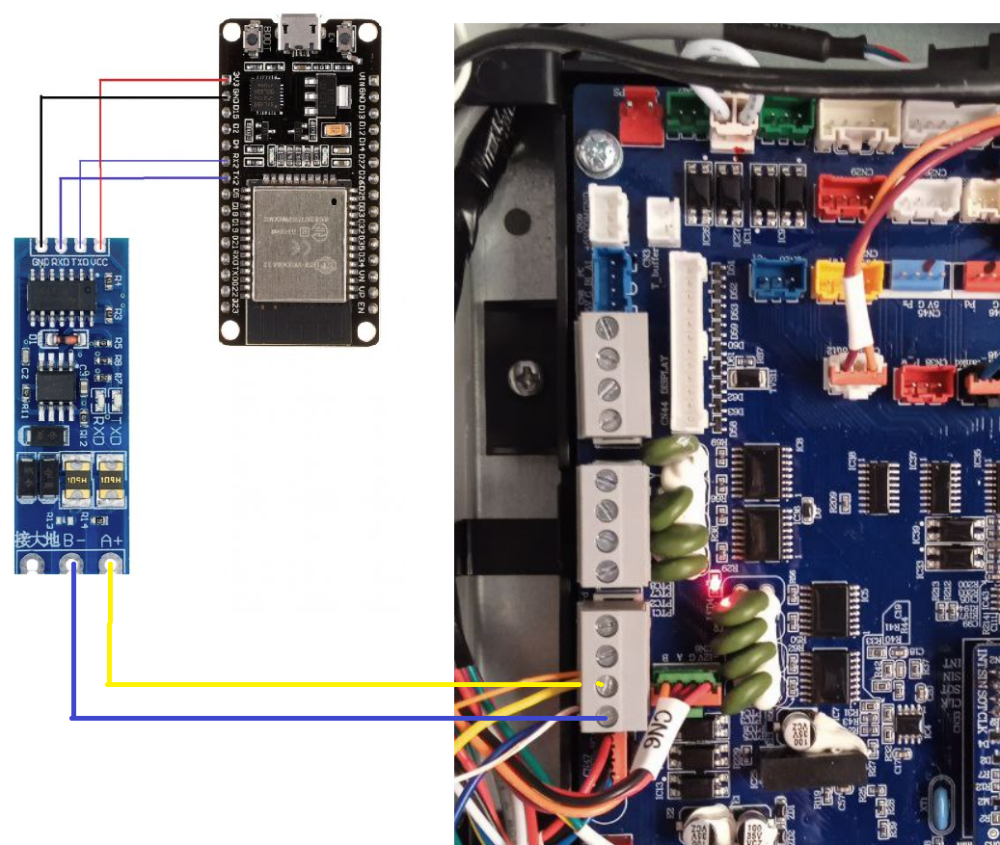
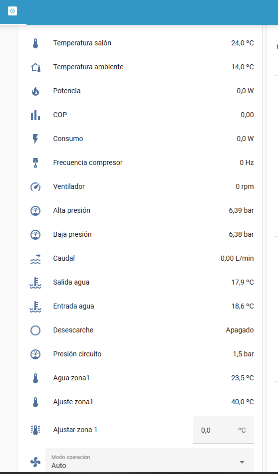

# esphome_Haier_Monoblock_GT_R290
🏠 Integración de Aerotermia Haier AW062MUGHA en Home Assistant con ESPHome y Modbus
```
📘 Descripción

Este proyecto permite integrar una máquina de aerotermia en Home Assistant utilizando ESPHome y el protocolo Modbus RTU/TCP.
El objetivo es monitorizar y controlar parámetros como temperaturas, modos de funcionamiento, compresor, bomba de agua, etc., directamente desde la interfaz de Home Assistant.
```
⚙️ Características principales

Comunicación mediante Modbus RTU o TCP.

Lectura de registros de sensores (temperaturas, presiones, potencias, etc.).

Control de modos de operación (calefacción, refrigeración, ACS).

Compatible con dispositivos ESP32.

Integración directa con Home Assistant mediante ESPHome.

Configurable mediante un único archivo .yaml.

```
🧩 Integración en Home Assistant

Copia el archivo aerotermia.yaml en tu carpeta de configuraciones de ESPHome.

Añádelo desde la interfaz de ESPHome Dashboard o mediante CLI:

esphome run aerotermia.yaml

Una vez flasheado el dispositivo, aparecerá automáticamente en Home Assistant.

Añade las entidades de sensores y controles según tus necesidades.

```

🔌 Conexión Modbus

Componente	Pin ESP32	Descripción.
RS485 A	GPIO17 (TX)	Línea A
RS485 B	GPIO16 (RX)	Línea B

## Schematics

```
                  RS485                      UART
┌────────────┐              ┌──────────┐                ┌─────────┐
│            │              │          │<----- RX ----->│         │
│    ATW     │<-----B- ---->│  RS485   │<----- TX ----->│ ESP32/  │
│            │<---- A+ ---->│  to TTL  │<----- GND ---->│ ESP8266 │
│            │              │  module  │<----- 3.3V --->│         │<-- VCC
│            │              │          │                │         │<-- GND
└────────────┘              └──────────┘                └─────────┘

```



⚠️ Asegúrate de que la dirección Modbus y la velocidad (baud_rate) coincidan con la configuración de tu máquina de aerotermia.

🧠 Recursos adicionales

📖 Documentación oficial de ESPHome Modbus

🔌 Guía Modbus Home Assistan https://esphome.io/components/modbus_controller.html

🧰 [Mapa Modbus Haier](./documents/HAIER_R290_ATW_MODBUS_REGISTER_SUBUNITS.pdf)

🖥️ Ejemplo de interfaz en Home Assistant



🤝 Contribuir

Si deseas mejorar la configuración o añadir compatibilidad con otros modelos de aerotermia:

Haz un fork del repositorio.

Crea una rama con tu mejora:

git checkout -b feature/nueva-funcionalidad


Envía un pull request describiendo los cambios.

🪪 Licencia

Este proyecto está licenciado bajo la MIT License.
Consulta el archivo LICENSE
 para más detalles.